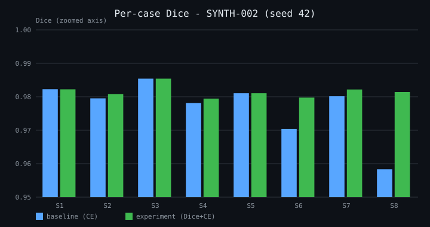
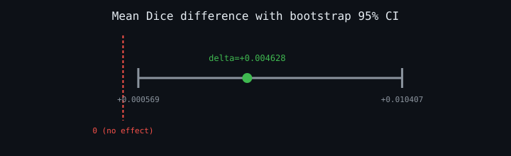

# ProtonAI Experiment Report

## Document Control
| ID | Version | Generated | Generator commit | Status |
|---|---|---|---|---|
| RPT-001 | 3.0 | 2026-09-28 18:44 UTC | 4273b0d | EFFECTIVE |

## 1. Executive Summary
Replacing the Cross-Entropy loss with a combined Dice+CE loss
improves organ-at-risk segmentation accuracy. Phase-2 evidence
(v0.3.0, calibrated phantom SYNTH-002 through the validated DICOM
pipeline): Wilcoxon one-sided p = 0.031250,
bootstrap 95% CI excluding 0, 3/3 seeds concordant.
Phase-3 evidence (v0.4.0): two-direction external validation shows
the gain is in-domain, not shift-robustness (MIXED: advantage in one direction only);
seed-ensemble uncertainty is informative and OOD-sensitive
(cross-domain failure AUC = 1.0,
OOD Mann-Whitney p = 0.0001), enabling the
documented physicist-review flagging policy (CLIN-001).
**Final verdict: STRONG EVIDENCE in-domain; clinical safety via
uncertainty flagging.**

## 2. Hypothesis
Combined Dice+CE loss yields higher Dice than CE alone for
organ-at-risk segmentation in head & neck CT (HYPOTHESIS.md).

## 3. Methods
- Ingestion: DICOM -> DicomReader -> HU pixels (ADR-001).
- Phantoms: SYNTH-001 (ingestion checks); SYNTH-002 calibrated
  (contrast +80 HU, noise 25, irregular lesions, bias field)
  after ceiling-effect discovery (ADR-004).
- Models: baseline torch_segmenter (CE) vs experimental_segmenter
  (Dice+CE); 40 epochs; seeds 42/123/999 for robustness.
- Statistics (ADR-003): Wilcoxon signed-rank (one-sided),
  bootstrap 95% CI, multi-seed concordance.

## 4. Results
### 4.1 Historical run (raw float phantoms, v0.2.0)
- Baseline 0.9994 vs Experiment 1.0000 (delta +0.0006); verdict: HYPOTHESIS SUPPORTED.

### 4.2 Phase-2 pipeline run (SYNTH-002)
| Metric | Value |
|---|---|
| Baseline mean Dice (CE) | 0.9769 |
| Experiment mean Dice (Dice+CE) | 0.9815 |
| Delta | +0.004628 |
| Wilcoxon one-sided p | 0.031250 |
| Bootstrap 95% CI | [+0.000569, +0.010407] |
| Multi-seed (42/123/999) | all SUPPORTED |





Secondary finding: Dice+CE reduces cross-case variance
(std 0.0087 -> 0.0019): a consistency gain of clinical relevance.

## 5. Evidence Integrity & Provenance
- Artifacts sealed by sha256 in
  docs/experiments/PROVENANCE_synth002.json.
- Integrity enforced by test_experiment_reproducibility.py
  (8 tests, incl. tamper detection).
- Provenance commit: 8fbdadf20345.

## 6. Limitations
- Synthetic phantoms lack real-scanner artifacts; validation on
  clinical CT remains mandatory (RISK_REGISTER R-003).
- Small sample (n=8 per arm); non-parametric methods used.

## 7. Reproducibility
```bash
python tools/make_synthetic_dicom.py --hard
python tools/run_pipeline_experiment.py SYNTH-002 \
    pipeline_experiment_synth002.json
python tools/experiment_statistics.py SYNTH-002 \
    experiment_statistics_synth002.json
python tools/make_provenance_manifest.py
pytest test_experiment_reproducibility.py -q
```

## 8. Governance References
ADR-001 (synthetic-first), ADR-002 (warning policy),
ADR-003 (statistical methods), ADR-004 (ceiling effect &
calibration); RISK_REGISTER R-001..R-008; CAPA_LOG CAPA-001.

## 9. Phase 3: Real-World Readiness Evidence

### 9.1 External validation (ADR-005)

| Model | inS1 | inS2 | cross S1->S2 | cross S2->S1 | gap12 | gap21 |
|---|---|---|---|---|---|---|
| baseline | 0.9999 | 0.9763 | 0.9455 | 0.9662 | +0.0308 | +0.0337 |
| experiment | 1.0000 | 0.9806 | 0.9401 | 0.9681 | +0.0404 | +0.0319 |

Verdict: MIXED: advantage in one direction only. Interpretation: Dice+CE is an in-domain
accuracy/consistency gain, not a distribution-shift robustness gain;
clinical safety therefore rests on uncertainty flagging (9.2).

### 9.2 Uncertainty quantification (ADR-006)

| Scope | mean uncertainty | Spearman rho | p | failure AUC |
|---|---|---|---|---|
| in-domain | 0.0018 | +0.3810 | 0.3518 | None |
| cross-domain | 0.0112 | +0.8095 | 0.0149 | 1.0 |

OOD sensitivity: Mann-Whitney p = 0.0001.
Verdict: UNCERTAINTY INFORMATIVE + OOD-SENSITIVE.

Clinical safety contract: any case whose vote-entropy exceeds the
documented in-domain maximum is auto-flagged for physicist review
(CLIN-001). The platform does not fail silently.

### 9.3 Evidence sealing (Phase 3)

| Artifact | sha256 (first 16) |
|---|---|
| docs/quality_system/iec_62304/ADR-005_EXTERNAL_VALIDATION.md | 1faaccbdecf1ba91 |
| docs/quality_system/iec_62304/ADR-006_UQ_METHODOLOGY.md | d943ae03d66ed5c3 |
| external_validation_results.json | 0e49047c132ddfaf |
| real_data_adapter.py | 9e7442476525c39a |
| tools/run_external_validation.py | 25dcaecdf220a379 |
| tools/run_uq_analysis.py | 85c1c4b518fa81ae |
| uq_analysis_results.json | 0b01ed3268faf93e |

Manifest: docs/experiments/PROVENANCE_phase3.json.

## 10. Document Revision History

| Version | Date | Commit | Scope |
|---|---|---|---|
| 1.0 | v0.2.0 era | - | initial v0.2.0 experiment evidence |
| 2.0 | Phase 2 | 82de338 | pipeline evidence, figures, gate |
| 3.0 | 2026-09-28 18:44 UTC | 4273b0d | Phase-3 validation + UQ + sealing |
